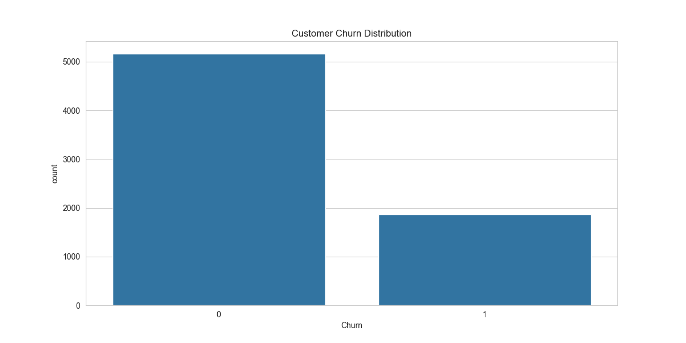
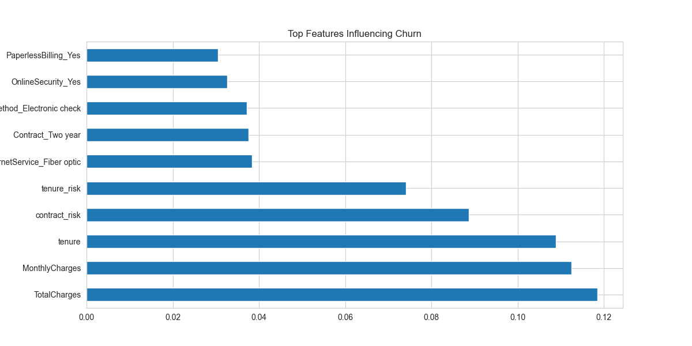

# 🚀 Customer Analytics & Churn Prediction System

## 📌 Overview
This project focuses on analyzing customer behavior and predicting churn using machine learning techniques. The objective is to identify high-risk customers and generate actionable insights that can help businesses improve customer retention and optimize decision-making.

---

## 🎯 Problem Statement
Customer churn is a critical challenge for subscription-based businesses. Losing customers directly impacts revenue and growth.

This project aims to:
- Predict customers likely to churn  
- Identify key factors influencing churn  
- Support data-driven customer retention strategies  

---

## 📊 Dataset
The project uses the **Telco Customer Churn dataset**, which contains customer-level information such as:

- **Tenure** – Duration of customer relationship  
- **Contract Type** – Month-to-month, yearly, etc.  
- **Monthly Charges** – Subscription cost  
- **Total Charges** – Overall revenue contribution  
- **Payment Method** – Billing preferences  
- **Churn** – Target variable (Yes/No)  

---

## ⚙️ Approach

### 1. Data Preprocessing
- Handled missing values and corrected data inconsistencies  
- Encoded categorical variables for model compatibility  
- Scaled numerical features for better performance  

### 2. Exploratory Data Analysis (EDA)
- Analyzed customer behavior patterns across different segments  
- Identified relationships between churn and key features  

### 3. Feature Engineering
- Created derived features such as tenure groups and contract-based risk indicators  
- Improved model interpretability and performance  

### 4. Handling Class Imbalance
- Applied **SMOTE (Synthetic Minority Oversampling Technique)** to balance the dataset  

### 5. Model Development
Implemented and compared multiple machine learning models:
- Logistic Regression  
- Random Forest  
- XGBoost  

### 6. Model Evaluation
Models were evaluated using:
- Accuracy  
- Precision & Recall  
- ROC-AUC Score  

---

## 📈 Key Insights

- Customers with **month-to-month contracts** have the highest churn risk  
- **Low-tenure customers** are more likely to churn early  
- Higher **monthly charges** correlate with increased churn probability  
- Customers using multiple services tend to have **higher retention rates**  

---

## 📊 Visualizations

### Churn Distribution


### Feature Importance


---

## 🧠 Business Impact

- Enables early identification of high-risk customers  
- Supports targeted retention strategies (offers, contract upgrades)  
- Helps optimize pricing and service offerings  
- Improves customer lifetime value through data-driven decisions  

---

## 🛠️ Tech Stack

- **Programming:** Python  
- **Libraries:** Pandas, NumPy, Scikit-learn, XGBoost  
- **Visualization:** Matplotlib, Seaborn  

---

## 📂 Project Structure

```
customer-churn-prediction/
│
├── data/                # Dataset
├── notebooks/           # Jupyter notebooks (EDA + modeling)
├── models/              # Saved models and scalers
├── images/              # Visualizations
├── requirements.txt     # Dependencies
└── README.md
```

---

## ▶️ How to Run

1. Clone the repository:
```
git clone <your-repo-link>
cd customer-churn-prediction
```

2. Install dependencies:
```
pip install -r requirements.txt
```

3. Run the notebook:
```
jupyter notebook notebooks/churn_analysis.ipynb
```


## 📌 Key Takeaway
This project demonstrates how data analysis and machine learning can be combined to generate meaningful business insights and support strategic decision-making.
